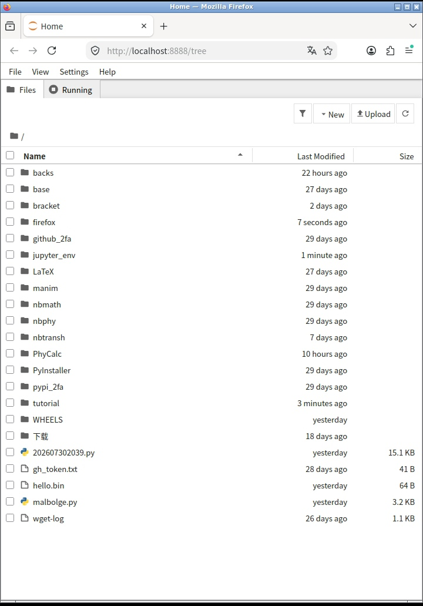
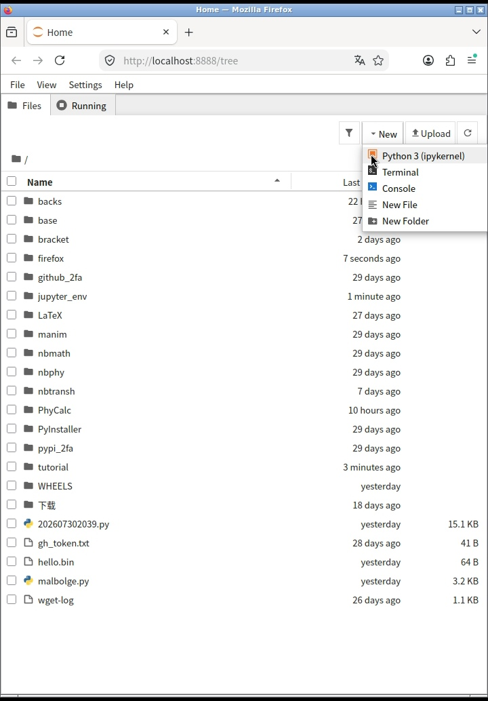
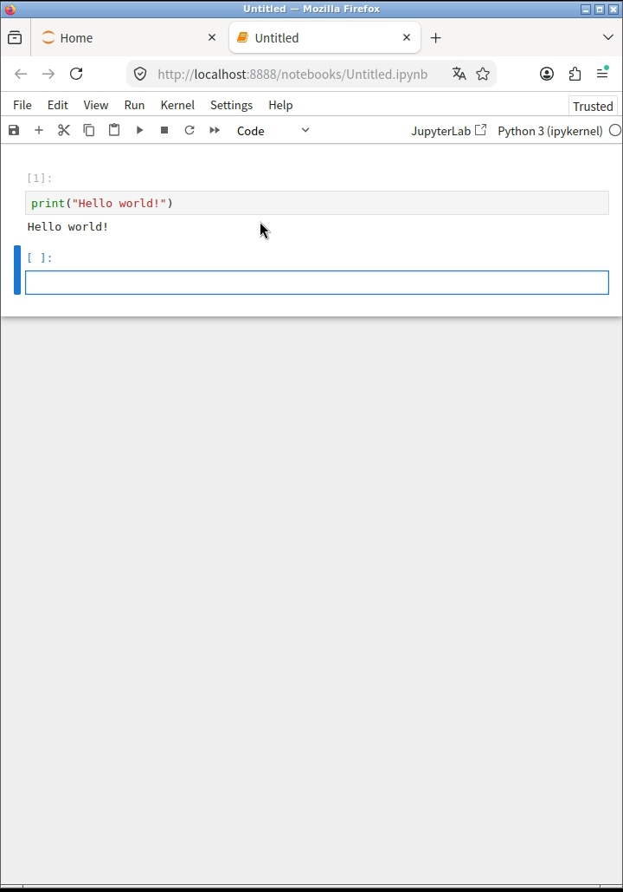
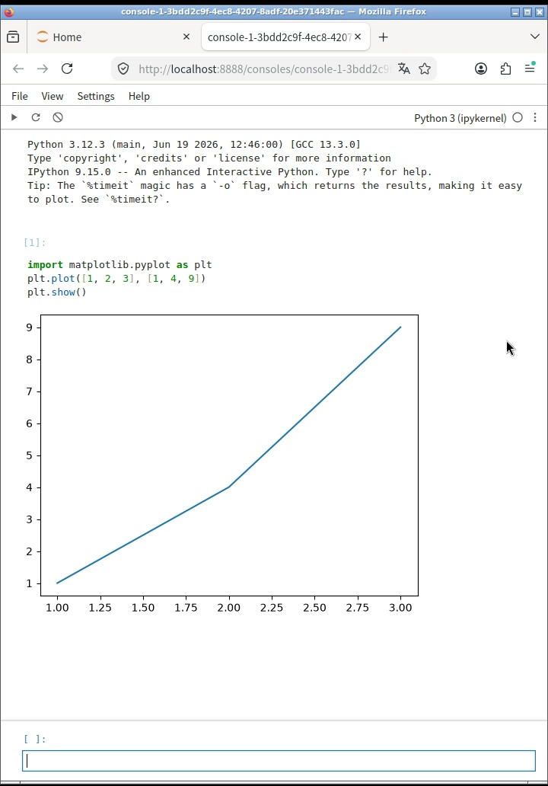
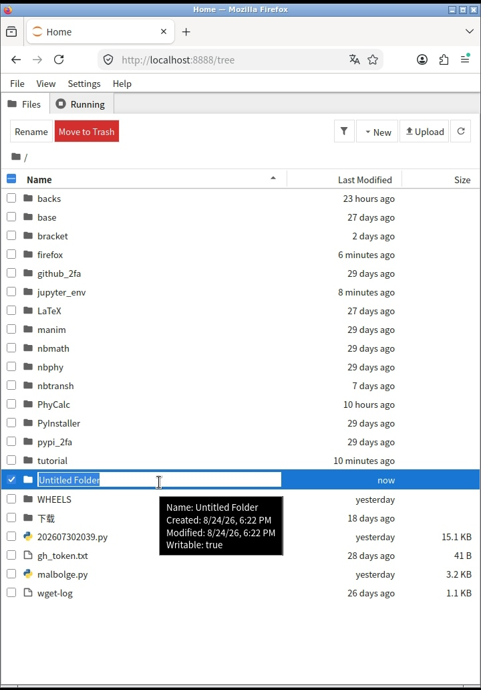

# Jupyter Notebook: 编程界最强的交互式文档工具
## 1 安装
### PC端
```bash
pip install notebook
```
### 手机端(安卓Termux)
```bash
# 安装系统库
pkg install psutil libzmq libzmq-static

# 预编译包仓库
pip install https://gitee.com/tc0512/wheels/raw/main/argon2_cffi_bindings-25.1.0-cp314-abi3-android_24_arm64_v8a.whl
pip install https://gitee.com/tc0512/wheels/raw/main/markupsafe-3.0.3-cp314-cp314-android_24_arm64_v8a.whl
pip install https://gitee.com/tc0512/wheels/raw/main/pyzmq-27.1.0-cp314-cp314-android_24_arm64_v8a.whl
pip install https://gitee.com/tc0512/wheels/raw/main/rpds_py-2026.6.3-cp314-cp314-android_24_arm64_v8a.whl
pip install https://gitee.com/tc0512/wheels/raw/main/tornado-6.5.8-cp39-abi3-android_24_arm64_v8a.whl

# 安装jupyterlab
pip install notebook
```

## 2 启动
```bash
jupyter notebook
```

## 3 使用







运行: 三角形按钮
保存: 硬盘形状按钮或Ctrl+S
更换内核: 右上角 "Python3 [ipykernel]" 
新单元格: 点击最下方单元格下面的带加号矩形框

## 4 注意事项
1. Jupyter Notebook耗电量较高, 手机慎用
2. 手机使用时建议在浏览器中勾选 "访问电脑版" 
3. Jupyter Terminal在手机浏览器很卡, 建议使用Termux-X11并安装火狐
4. 文本编辑器打开二进制文件/压缩文件会卡死
5. Jupyter Notebook魔法命令与IPython完全相同
6. Jupyter Notebook安装体积非常大(500MB), 硬盘吃紧者慎用
7. 手机安装其他语言的内核可能权限不足, 请务必使用`termux-chroot`命令
